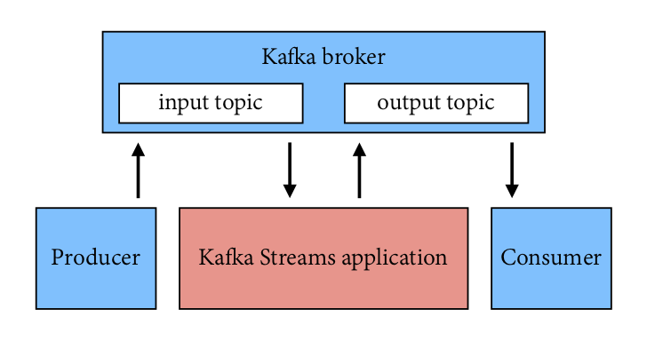
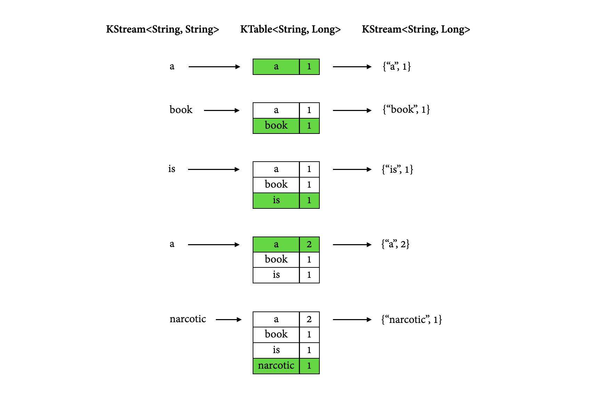

# Build a demo app with Kafka Streams

In the following tutorial, we will write a stream processing application using Kafka Streams and then run it with a simple Kafka producer and consumer.

> This tutorial is more or less a prettified version of the official Kafka Streams offerings found [here](https://kafka.apache.org/25/documentation/streams/quickstart) and [here](https://kafka.apache.org/25/documentation/streams/tutorial).

The application we will be building will compute a word occurrence histogram from the input text. Both its input and output destinations will be Kafka topics, and it will be able to operate on an infinite, unbounded stream of data.

Our architecture will look something like this:  


We will go through the setup and development step by step in the following sections:

[1. Setting up the project](#1-setting-up-the-project)  
[2. Setting up Kafka](#2-setting-up-kafka)  
[3. Piping data](#3-piping-data)  
[4. Splitting lines into words](#4-splitting-lines-into-words)  
[5. Counting words](#5-counting-words)  
[6. Tearing down the application](#6-tearing-down-the-application)  

Each section relies on the previous one so don't be tempted to skip any of them!

## 1. Setting up the project

First, make sure that you have:
- JDK 8 and Apache Maven 3.6 installed on your machine (check using $ java –version and $ mvn –version)
- Kafka 2.4.1 [downloaded](https://mirrors.ukfast.co.uk/sites/ftp.apache.org/kafka/2.4.1/kafka_2.12-2.4.1.tgz) and un-tarred

Then clone this repo and import the project in your favourite IDE.

The `pom.xml` file included in the project already has `kafka-streams` dependency defined. Note that this particular `pom.xml` targets Java 8 and does not work with higher Java versions.

## 2 Setting up Kafka

Next, we need to set up all things Kafka.

Navigate to the Kafka source on your computer and run a Zookeeper and a Kafka server (each in a separate Terminal):

```bash
$ bin/zookeeper-server-start.sh config/zookeeper.properties
$ bin/kafka-server-start.sh config/server.properties
```

Next, let's create a few input topics that we will read from (in a new Terminal):
```bash
$ bin/kafka-topics.sh --create \
--bootstrap-server localhost:9092 \
--replication-factor 1 \
--partitions 1 \
--topic streams-pipe-input
```

```bash
$ bin/kafka-topics.sh --create \
--bootstrap-server localhost:9092 \
--replication-factor 1 \
--partitions 1 \
--topic streams-linesplit-input
```

```bash
$ bin/kafka-topics.sh --create \
--bootstrap-server localhost:9092 \
--replication-factor 1 \
--partitions 1 \
--topic streams-wordcount-input
```

and a few output topics that we will write to:
```bash
$ bin/kafka-topics.sh --create \
--bootstrap-server localhost:9092 \
--replication-factor 1 \
--partitions 1 \
--topic streams-pipe-output
```

```bash
$ bin/kafka-topics.sh --create \
--bootstrap-server localhost:9092 \
--replication-factor 1 \
--partitions 1 \
--topic streams-linesplit-output
```

```bash
$ bin/kafka-topics.sh --create \
--bootstrap-server localhost:9092 \
--replication-factor 1 \
--partitions 1 \
--topic streams-wordcount-output \
--config cleanup.policy=compact
```

Note that we created the last output topic with log compaction enabled. We will explain what this does and why it is important in [section 5.3](#53-understanding-stream-processing).

We can inspect the newly created topics as follows:
```bash
$ bin/kafka-topics.sh --bootstrap-server localhost:9092 --describe
```

And should see all six topics listed, alongside the `__consumer_offsets` topic that Kafka automatically created for us. Note the partition counts, replication factors, and the assigned brokers:

```bash
Topic: streams-linesplit-output	PartitionCount: 1	ReplicationFactor: 1	Configs: segment.bytes=1073741824
	Topic: streams-linesplit-output	Partition: 0	Leader: 0	Replicas: 0	Isr: 0
Topic: streams-pipe-input	PartitionCount: 1	ReplicationFactor: 1	Configs: segment.bytes=1073741824
	Topic: streams-pipe-input	Partition: 0	Leader: 0	Replicas: 0	Isr: 0
Topic: streams-pipe-output	PartitionCount: 1	ReplicationFactor: 1	Configs: segment.bytes=1073741824
	Topic: streams-pipe-output	Partition: 0	Leader: 0	Replicas: 0	Isr: 0
Topic: streams-linesplit-input	PartitionCount: 1	ReplicationFactor: 1	Configs: segment.bytes=1073741824
	Topic: streams-linesplit-input	Partition: 0	Leader: 0	Replicas: 0	Isr: 0
Topic: streams-wordcount-output	PartitionCount: 1	ReplicationFactor: 1	Configs: cleanup.policy=compact,segment.bytes=1073741824
	Topic: streams-wordcount-output	Partition: 0	Leader: 0	Replicas: 0	Isr: 0
Topic: streams-wordcount-input	PartitionCount: 1	ReplicationFactor: 1	Configs: segment.bytes=1073741824
	Topic: streams-wordcount-input	Partition: 0	Leader: 0	Replicas: 0	Isr: 0
```

That's it for now - we will set up the console producers and consumers as we progress through the tutorial.

## 3. Piping data

We're now ready to dive into Kafka Streams! In this part of the tutorial, we will start with piping some data from the input topic to the output topic.

### 3.1 Configuring the application

Let's navigate to `src/main/java/myapps/Pipe.java` in the IDE:

```java
package myapps;

public class Pipe {

  public static void main(String[] args) throws Exception {

  }
}
```

We are going to fill in the `main` function to write this pipe program. Your IDE should be able to add the import statements automatically, but if not you will find the complete code with all the imports at the end of each section.

The first step to writing a Streams application is to create a `java.util.Properties` map to specify different Streams execution configuration values as defined in `StreamsConfig`. A couple of important configuration values we need to set are: `StreamsConfig.APPLICATION_ID_CONFIG`, which specifies a unique identifier for your Streams application to distinguish it from other applications talking to the same Kafka cluster, and `StreamsConfig.BOOTSTRAP_SERVERS_CONFIG`, which specifies a list of host/port pairs to use for establishing the initial connection to the Kafka cluster:

```java
Properties props = new Properties();  
props.put(StreamsConfig.APPLICATION_ID_CONFIG, "streams-pipe");  
props.put(StreamsConfig.BOOTSTRAP_SERVERS_CONFIG, "localhost:9092");
```

In addition, we can customise other configuration in the same map, for example, default serialisation and deserialisation libraries for the record key-value pairs:

```java
props.put(StreamsConfig.DEFAULT_KEY_SERDE_CLASS_CONFIG, Serdes.String().getClass());  
props.put(StreamsConfig.DEFAULT_VALUE_SERDE_CLASS_CONFIG, Serdes.String().getClass());
```

### 3.2 Defining the topology

Next we will define the computational logic of our application. In Kafka Streams this computational logic is defined as a `topology` of connected processor nodes. We can use a topology builder to construct such a topology,

```java
final StreamsBuilder builder = new StreamsBuilder();
```

and then create a source stream from the Kafka topic `streams-pipe-input` using this topology builder:

```java
KStream<String, String> source = builder.stream("streams-pipe-input");
```

Now we get a `KStream` that is continuously generating records from its source Kafka topic `streams-pipe-input`. The records are organized as `String` typed key-value pairs. The simplest thing we can do with this stream is to write it into another Kafka topic, `streams-pipe-output`:

```java
source.to("streams-pipe-output");
```

Note that we can also concatenate the above two lines into a single line as:

```java
builder.stream("streams-pipe-input").to("streams-pipe-output");
```

We can inspect what kind of `topology` is created from this builder by doing the following:

```java
final Topology topology = builder.build();
```

And print its description to standard output as:

```java
System.out.println(topology.describe());
```

If we just stop here, compile and run the program,

```bash
mvn clean package
mvn exec:java -Dexec.mainClass=myapps.Pipe
```

it will output the following information:

```bash
Topologies:
   Sub-topology: 0
    Source: KSTREAM-SOURCE-0000000000 (topics: [streams-pipe-input])
      --> KSTREAM-SINK-0000000001
    Sink: KSTREAM-SINK-0000000001 (topic: streams-pipe-output)
      <-- KSTREAM-SOURCE-0000000000
```

This log illustrates that the constructed topology has two processor nodes, a source node `KSTREAM-SOURCE-0000000000` and a sink node `KSTREAM-SINK-0000000001`. `KSTREAM-SOURCE-0000000000` continuously reads records from Kafka topic `streams-pipe-input` and pipes them to its downstream node `KSTREAM-SINK-0000000001`; `KSTREAM-SINK-0000000001` will write each of its received record in order to another Kafka topic `streams-pipe-output` (the `-->` and `<--` arrows dictate the downstream and upstream processor nodes of this node, i.e. "children" and "parents" within the topology graph).

Note that we can always describe the topology as we did above at any given point while we are building it in the code, so as a user you can interactively probe your computational logic defined in the topology until you are happy with it.

### 3.3 Constructing the Streams client

Suppose we are happy with this simple topology that just pipes data from one Kafka topic to another in an endless streaming manner, we can now construct a Streams client with the two components we have just constructed above: the configuration map specified in a `java.util.Properties` instance and the `Topology` object.

```java
final KafkaStreams streams = new KafkaStreams(topology, props);
```

By calling its `start()` function we can trigger the execution of this client. The execution won't stop until `close()` is called on this client. We can, for example, add a shutdown hook with a countdown latch to capture a user interrupt and close the client upon terminating this program:

```java
final CountDownLatch latch = new CountDownLatch(1);  

Runtime.getRuntime().addShutdownHook(new Thread("streams-shutdown-hook") {
  @Override  
  public void run() {  
    streams.close();  
    latch.countDown();  
  }  
});  
  
try {  
  streams.start();  
  latch.await();  
} catch (Throwable e) {  
  System.exit(1);  
}  
System.exit(0);
```

The complete code so far should look like this:

```java
package myapps;

import java.util.Properties;
import java.util.concurrent.CountDownLatch;
import org.apache.kafka.common.serialization.Serdes;
import org.apache.kafka.streams.KafkaStreams;
import org.apache.kafka.streams.StreamsBuilder;
import org.apache.kafka.streams.StreamsConfig;
import org.apache.kafka.streams.Topology;

public class Pipe {

  public static void main(String[] args) throws Exception {
    Properties props = new Properties();
    props.put(StreamsConfig.APPLICATION_ID_CONFIG, "streams-pipe");
    props.put(StreamsConfig.BOOTSTRAP_SERVERS_CONFIG, "localhost:9092");
    props.put(StreamsConfig.DEFAULT_KEY_SERDE_CLASS_CONFIG, Serdes.String().getClass());
    props.put(StreamsConfig.DEFAULT_VALUE_SERDE_CLASS_CONFIG, Serdes.String().getClass());

    final StreamsBuilder builder = new StreamsBuilder();

    builder.stream("streams-pipe-input").to("streams-pipe-output");

    final Topology topology = builder.build();
    final KafkaStreams streams = new KafkaStreams(topology, props);
    final CountDownLatch latch = new CountDownLatch(1);

    Runtime.getRuntime().addShutdownHook(new Thread("streams-shutdown-hook") {
      @Override
      public void run() {
        streams.close();
        latch.countDown();
      }
    });

    try {
      streams.start();
      latch.await();
    } catch (Throwable e) {
      System.exit(1);
    }
    System.exit(0);
  }
}
```

### 3.4 Starting the application

We should now be able to run the application code in the IDE or on the command line, using Maven:

```bash
$ mvn clean package
$ mvn exec:java -Dexec.mainClass=myapps.Pipe
```

Let's open a new Terminal and set up a console producer, so that we can write some data to the input topic `streams-pipe-input`:

```bash
$ bin/kafka-console-producer.sh --broker-list localhost:9092 --topic streams-pipe-input
```

And in another Terminal, set up a console consumer, subscribed to the output topic `streams-pipe-output`, to be able to inspect our application output:

```bash
$ bin/kafka-console-consumer.sh --bootstrap-server localhost:9092 \
--topic streams-pipe-output \
--from-beginning \
--formatter kafka.tools.DefaultMessageFormatter \
--property print.key=true \
--property print.value=true \
--property key.deserializer=org.apache.kafka.common.serialization.StringDeserializer \
--property value.deserializer=org.apache.kafka.common.serialization.StringDeserializer
```

Let's write a message with the console producer into the input topic `streams-pipe-input` by entering a single line of text and then hitting `<RETURN>`:

```
I am free and that is why I am lost
```

This will send a new message to the input topic, where the message key is null and the message value is the entered string-encoded text line. (In practice, input data for applications will typically be streaming continuously into Kafka, rather than being manually entered as we do in this demo.)

The message will be piped by the application, written to the `streams-pipe-output` topic, and both its key and value will be printed by the console consumer:

```
null	I am free and that is why I am lost
```

That's great - our application is able to read messages from a Kafka topic, pipe them and write them to another Kafka topic!

We can stop the console consumer, the console producer and the application with `Ctrl-C`, and move on to the next section of the tutorial.

## 4. Splitting lines into words

Now let's add some real processing logic by augmenting the current topology.

### 4.1 Adding the logic

We can first create another program by copying the existing `Pipe.java` class:

```bash
cp src/main/java/myapps/Pipe.java src/main/java/myapps/LineSplit.java
```

We also need to change its class name and application id config to distinguish it from the original program:
```java
public class LineSplit {
 
    public static void main(String[] args) throws Exception {
        Properties props = new Properties();
        props.put(StreamsConfig.APPLICATION_ID_CONFIG, "streams-linesplit");
        // ...
    }
}
```

Let's change the input topic to `streams-linesplit-input`:

```java
KStream<String, String> source = builder.stream("streams-linesplit-input");
```

Now, since each of the source stream's records is a `String` typed key-value pair, let's treat the value string as a text line and split it into words with a `flatMapValues` operator:

```java
KStream<String, String> words = source.flatMapValues(value -> Arrays.asList(value.split("\\W+")));
```

The operator will take the source stream as its input, and generate a new stream named `words` by processing each record from its source stream in order. It will break each record's value string into a list of words, and produce each word as a new record to the output words stream. This is a stateless operator that does not need to keep track of any previously received records or processed results.

And finally we can write the word stream back into another Kafka topic, `streams-linesplit-output`:

```java
KStream<String, String> source = builder.stream("streams-linesplit-input");
source.flatMapValues(value -> Arrays.asList(value.split("\\W+")))
      .to("streams-linesplit-output");
```

If we now describe this augmented topology using `System.out.println(topology.describe())`, we will get the following:

```brew
$ mvn clean package
$ mvn exec:java -Dexec.mainClass=myapps.LineSplit

Topologies:
   Sub-topology: 0
    Source: KSTREAM-SOURCE-0000000000 (topics: [streams-linesplit-input])
      --> KSTREAM-FLATMAPVALUES-0000000001
    Processor: KSTREAM-FLATMAPVALUES-0000000001 (stores: [])
      --> KSTREAM-SINK-0000000002
      <-- KSTREAM-SOURCE-0000000000
    Sink: KSTREAM-SINK-0000000002 (topic: streams-linesplit-output)
      <-- KSTREAM-FLATMAPVALUES-0000000001
```

As we can see above, a new processor node `KSTREAM-FLATMAPVALUES-0000000001` is injected into the topology between the original source and sink nodes. It takes the source node as its parent and the sink node as its child. In other words, each record fetched by the source node will first traverse to the newly added `KSTREAM-FLATMAPVALUES-0000000001` node to be processed, and one or more new records will be generated as a result. They will continue traverse down to the sink node to be written back to Kafka. Note that this processor node is "stateless" as it is not associated with any state store (i.e. `stores: []`).

Our complete code should now look like this:

```java
package myapps;

import java.util.Arrays;
import java.util.Properties;
import java.util.concurrent.CountDownLatch;
import org.apache.kafka.common.serialization.Serdes;
import org.apache.kafka.streams.KafkaStreams;
import org.apache.kafka.streams.StreamsBuilder;
import org.apache.kafka.streams.StreamsConfig;
import org.apache.kafka.streams.Topology;
import org.apache.kafka.streams.kstream.KStream;
 
public class LineSplit {
 
  public static void main(String[] args) throws Exception {
    Properties props = new Properties();
    props.put(StreamsConfig.APPLICATION_ID_CONFIG, "streams-linesplit");
    props.put(StreamsConfig.BOOTSTRAP_SERVERS_CONFIG, "localhost:9092");
    props.put(StreamsConfig.DEFAULT_KEY_SERDE_CLASS_CONFIG, Serdes.String().getClass());
    props.put(StreamsConfig.DEFAULT_VALUE_SERDE_CLASS_CONFIG, Serdes.String().getClass());

    final StreamsBuilder builder = new StreamsBuilder();

    KStream<String, String> source = builder.stream("streams-linesplit-input");
    source.flatMapValues(value -> Arrays.asList(value.split("\\W+")))
          .to("streams-linesplit-output");

    final Topology topology = builder.build();
    final KafkaStreams streams = new KafkaStreams(topology, props);

    // ... same as Pipe.java above
  }
}
```

### 4.2 Running the application

As before, we can run the application code in the IDE or on the command line, using Maven:

```bash
$ mvn clean package
$ mvn exec:java -Dexec.mainClass=myapps.LineSplit
```

Again, we will need to set up a new producer and a new consumer:

```bash
$ bin/kafka-console-producer.sh --broker-list localhost:9092 --topic streams-linesplit-input
```

```bash
$ bin/kafka-console-consumer.sh --bootstrap-server localhost:9092 \
--topic streams-linesplit-output \
--from-beginning \
--formatter kafka.tools.DefaultMessageFormatter \
--property print.key=true \
--property print.value=true \
--property key.deserializer=org.apache.kafka.common.serialization.StringDeserializer \
--property value.deserializer=org.apache.kafka.common.serialization.StringDeserializer
```

Let's write a message with the console producer into the input topic `streams-linesplit-input`:

```
There is an infinite amount of hope in the universe ... but not for us
```

This message will be processed by the application and the word stream will be written to the `streams-linesplit-output` topic and printed by the console consumer:

```
null	There
null	is
null	an
null	infinite
null	amount
null	of
null	hope
null	in
null	the
null	universe
null	but
null	not
null	for
null	us
```

So far so good! We can stop the console consumer, the console producer and the application, and move on to the next section.

## 5. Counting words

Let's now take a step further to add some "stateful" computations to the topology by counting the occurrence of the words split from the source text stream.

### 5.1 Adding the logic

Following similar steps as before, let's create another program based on the `LineSplit.java` class, named `WordCount.java`:

```java
public class WordCount {
 
  public static void main(String[] args) throws Exception {
    Properties props = new Properties();
    props.put(StreamsConfig.APPLICATION_ID_CONFIG, "streams-wordcount");
    // ...
  }
}
```

Let's change the input topic to `streams-wordcount-input`:

```java
KStream<String, String> source = builder.stream("streams-wordcount-input");
```

Then, in order to count the words, we can first modify the `flatMapValues` operator to treat all of them as lower case:

```java
KStream<String, String> words = source
  .flatMapValues(value -> Arrays.asList(value.toLowerCase(Locale.getDefault()).split("\\W+")));
```

Next, we need to specify that we want to key the stream on the value string, i.e. the lower cased word, with the `groupBy` operator. This operator will generate a new grouped stream, which can then be aggregated with the `count` operator, which generates a running count on each of the grouped keys:

```java
KTable<String, Long> counts = words
  .groupBy((key, value) -> value)
  .count(Materialized.<String, Long, KeyValueStore<Bytes, byte[]>>as("counts-store"));
```

Note that the count operator has a `Materialized` parameter that specifies that the running count should be stored in a `KeyValueStore` named `counts-store`. This store can be queried in real-time. Also note that the `Materialized` store is always of type `<Bytes, byte[]>` as this is the format of the inner most store.

We can also write the `counts` KTable's changelog stream back into another Kafka topic, say `streams-wordcount-output`. Note that this time the value type is no longer `String` but `Long`, so the default serialization classes are not viable for writing it to Kafka anymore. We need to provide overridden serialization methods for `Long` types, otherwise a runtime exception will be thrown:

```java
counts.toStream().to("streams-wordcount-output", Produced.with(Serdes.String(), Serdes.Long()));
```

The above code can be simplified as:

```java
KStream<String, String> source = builder.stream("streams-wordcount-input");
source.flatMapValues(value -> Arrays.asList(value.toLowerCase(Locale.getDefault()).split("\\W+")))
  .groupBy((key, value) -> value)
  .count(Materialized.<String, Long, KeyValueStore<Bytes, byte[]>>as("counts-store"))
  .toStream()
  .to("streams-wordcount-output", Produced.with(Serdes.String(), Serdes.Long()));
```

If we again describe this augmented topology with `System.out.println(topology.describe())`, we will get the following:

```java
$ mvn clean package
$ mvn exec:java -Dexec.mainClass=myapps.WordCount

Topologies:
   Sub-topology: 0
    Source: KSTREAM-SOURCE-0000000000 (topics: [streams-wordcount-input])
      --> KSTREAM-FLATMAPVALUES-0000000001
    Processor: KSTREAM-FLATMAPVALUES-0000000001 (stores: [])
      --> KSTREAM-KEY-SELECT-0000000002
      <-- KSTREAM-SOURCE-0000000000
    Processor: KSTREAM-KEY-SELECT-0000000002 (stores: [])
      --> counts-store-repartition-filter
      <-- KSTREAM-FLATMAPVALUES-0000000001
    Processor: counts-store-repartition-filter (stores: [])
      --> counts-store-repartition-sink
      <-- KSTREAM-KEY-SELECT-0000000002
    Sink: counts-store-repartition-sink (topic: counts-store-repartition)
      <-- counts-store-repartition-filter

  Sub-topology: 1
    Source: counts-store-repartition-source (topics: [counts-store-repartition])
      --> KSTREAM-AGGREGATE-0000000003
    Processor: KSTREAM-AGGREGATE-0000000003 (stores: [counts-store])
      --> KTABLE-TOSTREAM-0000000007
      <-- counts-store-repartition-source
    Processor: KTABLE-TOSTREAM-0000000007 (stores: [])
      --> KSTREAM-SINK-0000000008
      <-- KSTREAM-AGGREGATE-0000000003
    Sink: KSTREAM-SINK-0000000008 (topic: streams-wordcount-output)
      <-- KTABLE-TOSTREAM-0000000007
```

As we can see above, the topology now contains two disconnected sub-topologies. The first sub-topology's sink node `counts-store-repartition-sink` will write to a repartition topic `counts-store-repartition`, which will be read by the second sub-topology's source node `counts-store-repartition-source`. The repartition topic is used to "shuffle" the source stream by its aggregation key, which in this case is the value string. In addition, inside the first sub-topology a stateless `counts-store-repartition-filter` node is injected between the grouping `KSTREAM-KEY-SELECT-0000000002` node and the sink node to filter out any intermediate records whose aggregate keys are empty.

In the second sub-topology, the aggregation node `KSTREAM-AGGREGATE-0000000003` is associated with a state store named `counts-store` (we specified the name in the `count` operator). Upon receiving each record from its upcoming stream source node, the aggregation processor will first query its associated `counts-store` store to get the current count for that key, augment it by one, and then write the new count back to the store. Each updated count for the key will also be piped downstream to the `KTABLE-TOSTREAM-0000000007` node, which will interpret this update stream as a record stream before further piping it to the sink node `KSTREAM-SINK-0000000008` for writing back to Kafka.

For reference, the complete code should look like this:

```java
package myapps;

import java.util.Arrays;
import java.util.Properties;
import java.util.concurrent.CountDownLatch;
import org.apache.kafka.common.serialization.Serdes;
import org.apache.kafka.common.utils.Bytes;
import org.apache.kafka.streams.KafkaStreams;
import org.apache.kafka.streams.StreamsBuilder;
import org.apache.kafka.streams.StreamsConfig;
import org.apache.kafka.streams.Topology;
import org.apache.kafka.streams.kstream.KStream;
import org.apache.kafka.streams.kstream.Materialized;
import org.apache.kafka.streams.kstream.Produced;
import org.apache.kafka.streams.state.KeyValueStore;

public class WordCount {

  public static void main(String[] args) throws Exception {
    Properties props = new Properties();
    props.put(StreamsConfig.APPLICATION_ID_CONFIG, "streams-wordcount");
    props.put(StreamsConfig.BOOTSTRAP_SERVERS_CONFIG, "localhost:9092");
    props.put(StreamsConfig.DEFAULT_KEY_SERDE_CLASS_CONFIG, Serdes.String().getClass());
    props.put(StreamsConfig.DEFAULT_VALUE_SERDE_CLASS_CONFIG, Serdes.String().getClass());

    final StreamsBuilder builder = new StreamsBuilder();

    KStream<String, String> source = builder.stream("streams-wordcount-input");
    source.flatMapValues(value -> Arrays.asList(value.toLowerCase().split("\\W+")))
        .groupBy((key, value) -> value)
        .count(Materialized.<String, Long, KeyValueStore<Bytes, byte[]>>as("counts-store"))
        .toStream()
        .to("streams-wordcount-output", Produced.with(Serdes.String(), Serdes.Long()));

    final Topology topology = builder.build();
    final KafkaStreams streams = new KafkaStreams(topology, props);
    final CountDownLatch latch = new CountDownLatch(1);

    // ... same as Pipe.java above
  }
}
```

### 5.2 Running the application

As before, we can run the application code in the IDE or on the command line, using Maven:

```bash
$ mvn clean package
$ mvn exec:java -Dexec.mainClass=myapps.WordCount
```

Again, we need to set up a new producer and a new consumer:

```bash
$ bin/kafka-console-producer.sh --broker-list localhost:9092 --topic streams-wordcount-input
```

```bash
$ bin/kafka-console-consumer.sh --bootstrap-server localhost:9092 \
--topic streams-wordcount-output \
--from-beginning \
--formatter kafka.tools.DefaultMessageFormatter \
--property print.key=true \
--property print.value=true \
--property key.deserializer=org.apache.kafka.common.serialization.StringDeserializer \
--property value.deserializer=org.apache.kafka.common.serialization.LongDeserializer
```

Note that in order to read the changelog stream from topic `streams-wordcount-output`, we need to set the value deserialization as `org.apache.kafka.common.serialization.LongDeserializer`.

Let's write a message with the console producer into the input topic `streams-wordcount-input`:

```
A book is a narcotic
```

This message will be processed by the application and the word count stream will be written to the `streams-wordcount-output` topic and printed by the console consumer:

```
a           1
book        1
is          1
a           2
narcotic    1
```

Here, the first column is the Kafka message key in `java.lang.String` format and represents a word that is being counted, and the second column is the message value in `java.lang.Longformat`, representing the word's latest count.

Notice that the word `a` first appears with a count of 1, and is later on updated to the count of 2.

Let's enter another text line:

```
A book must be the axe for the frozen sea within us
```

and we should see the following output printed below the previous lines:

```
a       3
book    2
must    1
be      1
the     1
axe     1
for     1
the     1
frozen  1
sea     1
within  1
us      1
```

Notice that the words `a` and `book` have been incremented from 2 to 3, and from 1 to 2, respectively. The rest of the new words have also been printed with the word count of 1, but the words from previous lines have not been printed again.

With another line:
```
Many a book is like a key to unknown chambers within the castle of one’s own self
```

the output would be:

```
many        1
a           4
book        3
is          1
like        1
a           5
key         1
to          1
unknown     1
chambers    1
within      1
the         2
castle      1
of          1
one's       1
own         1
self        1
```

As we can see, the output of the word count application is actually a continuous stream of updates, where each output record is an updated count of a single word, aka record key such as `book`. For multiple records with the same key, each later record is an update of the previous one.

(If you want to keep playing with your word count application and need some more inspiring lines of text, see [here](https://en.wikiquote.org/wiki/Franz_Kafka#Quotes) for more quotes by Franz Kafka, the novelist after whom Kafka was named.)

### 5.3 Understanding stream processing

The diagram below illustrates what is happening behind the scenes. The first column shows the word stream `KStream<String, String>` that results from the incoming stream of text lines. The second column shows the evolution of the current state of the `KTable<String, Long>` that is counting word occurrences. The third column shows the stream `KStream<String, Long>` consisting of change records that result from state updates to the `KTable` and that are being sent to the output Kafka topic `streams-wordcount-output`.



As the first few words are being processed, the `KTable` is being built up as each new word results in a new table entry (highlighted with a green background), and a corresponding change record is sent to the downstream `KStream`. Then, when words start repeating (such as the word `a`), existing entries in the `KTable` start being updated. And again, change records are being sent to the output topic.

Looking beyond the scope of this concrete example, what Kafka Streams is doing here is leveraging the duality between a table and a changelog stream. We can publish every change of the table to a stream, and if we consume the entire changelog stream from beginning to end, we can reconstruct the contents of the table.

It should now also be clear why we used log compaction for the `streams-wordcount-output` topic. Log compaction will retain only the last known value for each record key and will delete the old duplicates, so it can save some space. We can use log compaction in this case since the output stream is a changelog stream, and the most recent updates contain all the information we need to reconstruct the contents of our table. Previous record updates are superfluous and can be safely deleted.

## 6. Tearing down the application

We can now stop the console consumer, the console producer, our word count application, the Kafka broker and the ZooKeeper server (in this order) with `Ctrl-C`.

_That's it! If you liked the tutorial, you can show your love by starring it._